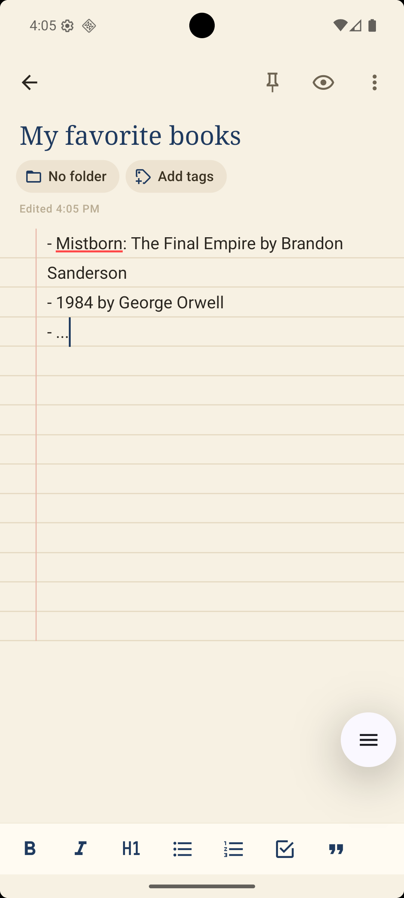
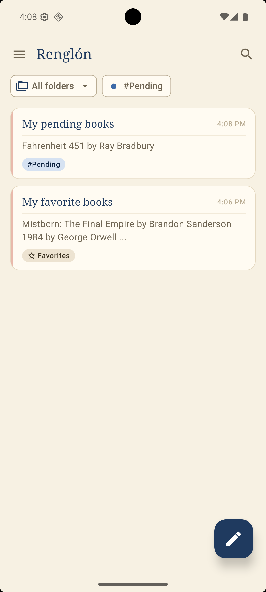
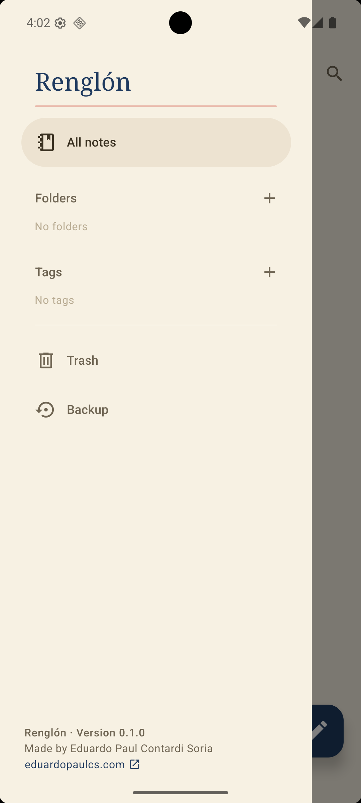

# Renglón

**A notebook for your phone, and nothing else.** *Renglón* is Spanish for the ruled line you
write on, and that is the whole idea: open the app, write on the line, close it. No account, no
sync, no ads, no network. Your notes live on your phone, in a plain database, and nowhere else.

|  |  |  |  |
| :--: | :--: | :--: | :--: |
| Opening | Writing | Finding | Organizing |

## What it does

- **Finds a note in one word.** Full-text search that ignores accents and matches as you type.
- **Sorts the way you think.** Folders with an icon, tags with a color, and both as filters on
  the list.
- **Writes with formatting.** Bold, headings, lists and checkboxes from a bar above the keyboard,
  with a preview a tap away. Under the hood it is Markdown, so the text outlives the app.
- **Forgives mistakes.** Deleting moves to the trash, with undo; the trash restores or empties
  when you say so.
- **Moves in bulk.** Long-press to select several notes and pin, tag, move or delete them at once.
- **Hands your notes back.** One backup file with everything, saved to the phone or sent to
  another app, and imported without ever overwriting a newer note.

Written in Spanish and English: the app follows the phone's language.

Not on the Play Store yet.

## Built with

| Layer | Tool |
| --- | --- |
| Framework | Expo SDK 57 (React Native 0.86) |
| Language | TypeScript |
| Routing | expo-router |
| Database | expo-sqlite + Drizzle ORM |
| Search | FTS5 |
| UI | react-native-paper (Material 3) |

Android 7+ (minSdk 24), compiled against API 36.

## Getting started

```bash
npm install
npm run doctor     # checks the environment before building
npm run android    # first run: boots the emulator and builds (slow)
npm run dev        # afterwards: emulator + Metro
```

`npm run android` starts the emulator on its own and waits for it to finish booting, so there
is no need to open it by hand.

## Environment requirements

- Node 20+ (`.nvmrc` pins the version in use)
- Android SDK with the emulator, installed through Android Studio or the command-line tools
- **JDK 21**. Newer JDKs break the Android Gradle Plugin build
- `ANDROID_HOME` and `JAVA_HOME` set
- Hardware virtualization for the emulator. On Windows: the `HypervisorPlatform` feature
  enabled. Verify it with `emulator -accel-check`.

`npm run doctor` checks all of this and reports what is missing.

## Structure

```
src/
  app/          screens (expo-router)
  db/           schema, client and queries
  theme/        light and dark themes
drizzle/        generated SQL migrations, plus the hand-written FTS5 one
scripts/        emulator boot, environment check and icon export
docs/           screenshots
```

`android/` is not versioned: it is generated by `expo prebuild` from `app.config.ts`.
